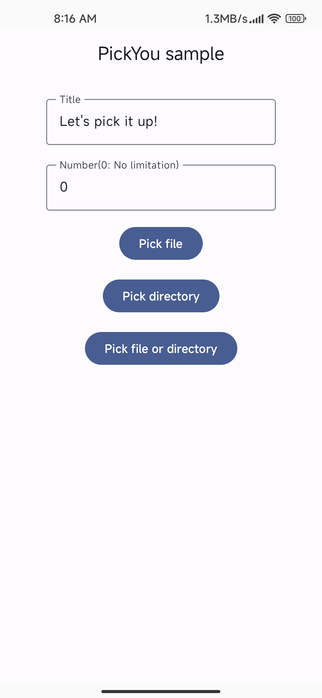
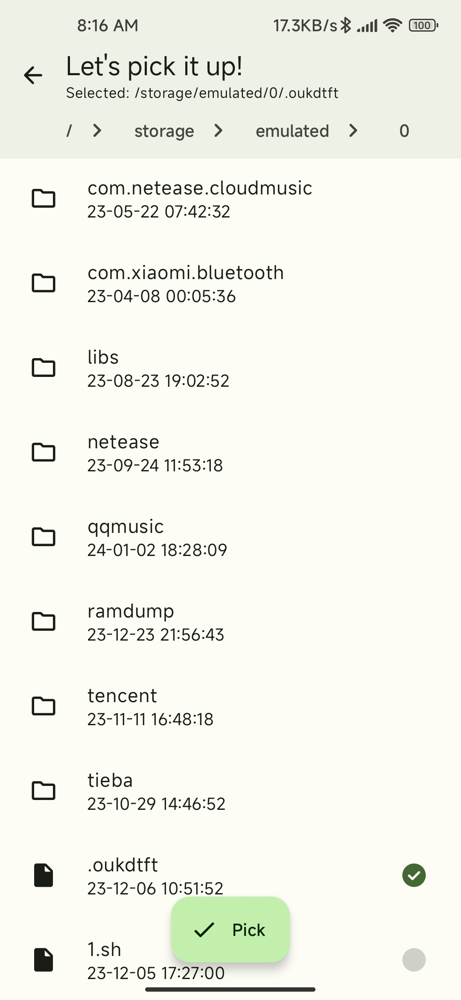
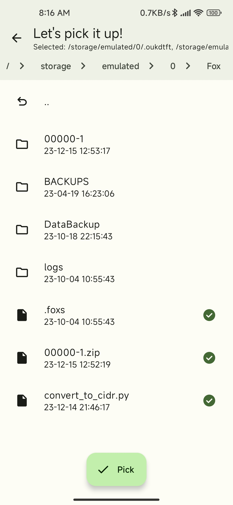
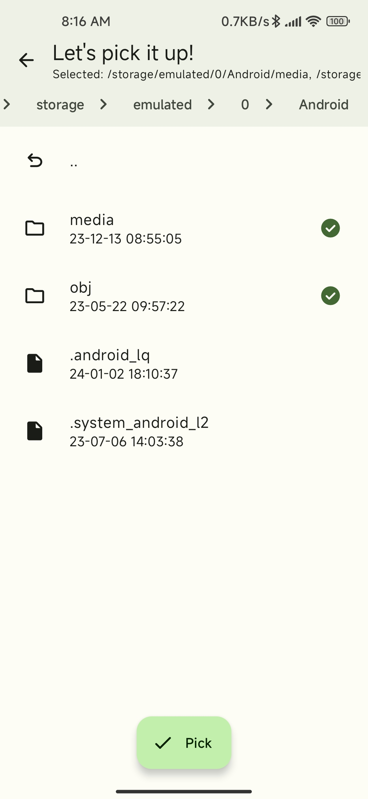
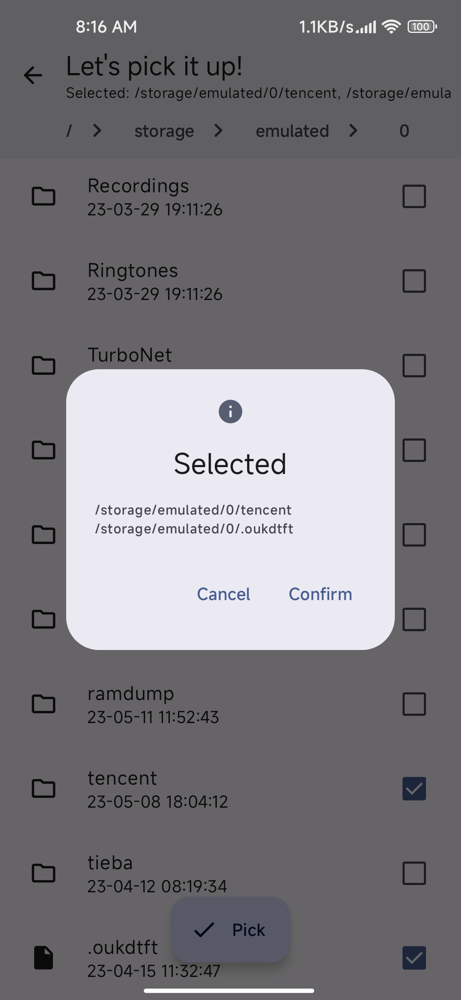

<div align="center">
	<span style="font-weight: bold"> English</span>
</div>

# PickYou
[](https://jitpack.io/#xayahsususu/libpickyou)   [](./LICENSE)

Android file picker module with the style of Material You.

Use this module to pick files/directories easily.

## Features
- Write in [**compose**](https://developer.android.com/jetpack/compose)
- Easy to import and use.
- Highly customizable.
- Support for single/multiple selection.
- Monet enabled.

## Screenshots
<div align="center">
	
	
</div>

## Implementation
1. Enable **JitPack** in `settings.gradle`/`settings.gradle.kts`
* **Groovy**
```
repositories {
    // ......
    maven { url 'https://jitpack.io' }
}
```
* **Kotlin**
```
repositories {
    // ......
    maven("https://jitpack.io")
}
```
2. Implementation
* **Groovy**
```
implementation 'com.github.xayahsususu:libpickyou:$PickYouVersion'
```

* **Kotlin**
```
implementation("com.github.xayahsususu:libpickyou:$PickYouVersion")
```

## Usage
1. Launch anywhere
```
val launcher = PickYouLauncher()
launcher.launch(context) { path ->
    // Code here.
}
```

2. Customization

See [PickYouLauncher](./libpickyou/src/main/kotlin/com/xayah/libpickyou/ui/PickYouLauncher.kt)

## Sample
See [sample](./app/src/main/kotlin/com/xayah/pickyou/MainActivity.kt)

## Credits
- [libsu](https://github.com/topjohnwu/libsu)
- [MaterialFiles](https://github.com/zhanghai/MaterialFiles)
