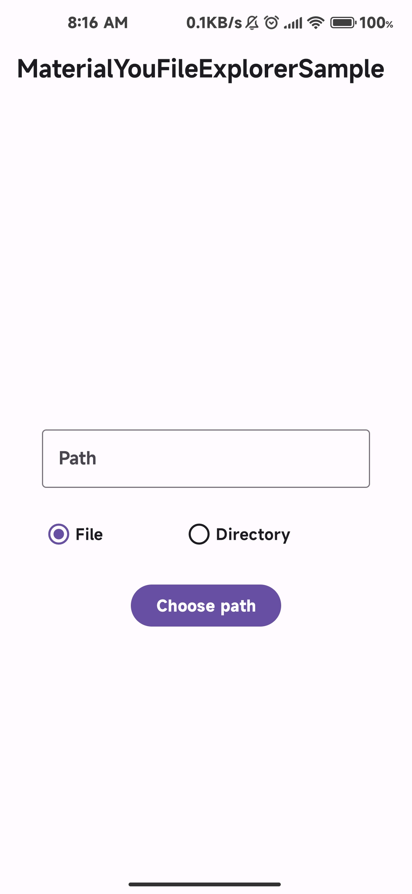
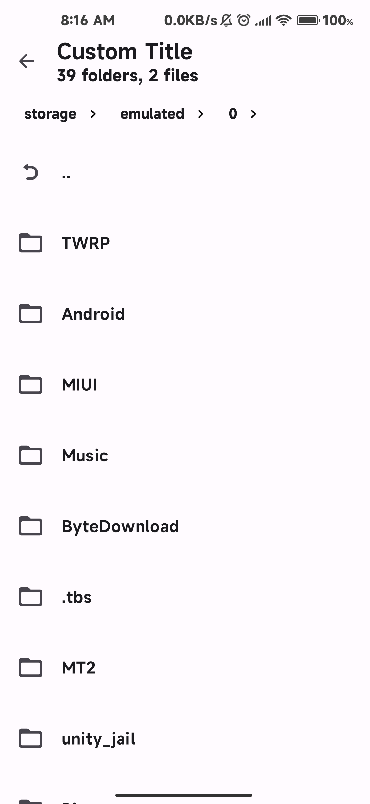
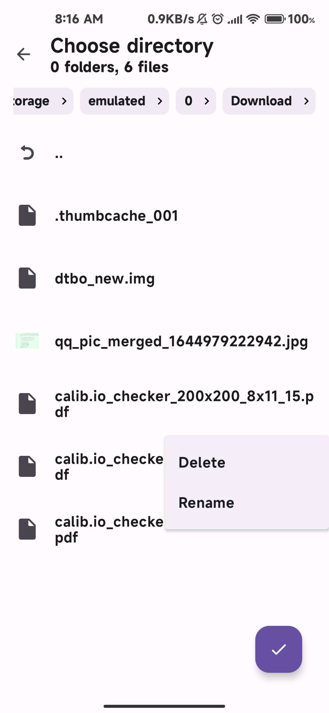

# MaterialYouFileExplorer
[](https://github.com/XayahSuSuSu/Android-MaterialYouFileExplorer/releases)   [](./LICENSE)

一个Material You风格的文件浏览器（选择器）第三方库。

使用这个第三方库来快速选择文件/文件夹。

## 特点
- 易于导入和使用。
- 高度可自定义化
- 支持选择文件或文件夹
- 支持过滤
- 支持选择文件/文件夹时管理文件/文件夹（删除、重命名）

## 截图







## 引入
1. 在 `settings.gradle` 中开启 `mavenCentral()`
```
repositories {
        ......
        mavenCentral()
    }
```
2. 引入MaterialYouFileExplorer
```
implementation 'io.github.xayahsususu:materialyoufileexplorer:1.1.1'
```

## 使用
1. 在 `onCreate()` 中初始化
```
val materialYouFileExplorer = MaterialYouFileExplorer()
materialYouFileExplorer.initialize(this)
```
2. 打开Explorer Activity并且处理回调
```
materialYouFileExplorer.toExplorer(this, isFile) { path, isFile -> 
    // Code here
}
```
#### 自定义标题
```
materialYouFileExplorer.toExplorer(this, isFile, "Custom Title") { path, isFile -> 
    // Code here
}
```


## 样本
```
class MainActivity : AppCompatActivity() {
    override fun onCreate(savedInstanceState: Bundle?) {
        super.onCreate(savedInstanceState)
        val binding = ActivityMainBinding.inflate(layoutInflater)
        setContentView(binding.root)

        val materialYouFileExplorer = MaterialYouFileExplorer()
        materialYouFileExplorer.initialize(this)

        binding.filledButton.setOnClickListener {
            materialYouFileExplorer.toExplorer(
                this,
                binding.radioButtonFile.isChecked,
                if (binding.checkBox.isChecked) binding.textInputEditTextTitle.text.toString() else "default",
                ArrayList(binding.textInputEditTextFilter.text.toString().split(",")),
                binding.checkBoxFilterWhitelist.isChecked
            ) { path, _ -> binding.textInputEditText.setText(path) }
        }
    }
}
```

## 鸣谢
- [libsu](https://github.com/topjohnwu/libsu)
- [PermissionX](https://github.com/guolindev/PermissionX)
- [MaterialFiles](https://github.com/zhanghai/MaterialFiles)
- [Coil](https://github.com/coil-kt/coil)
- [ActivityResultLauncher](https://github.com/DylanCaiCoding/ActivityResultLauncher)